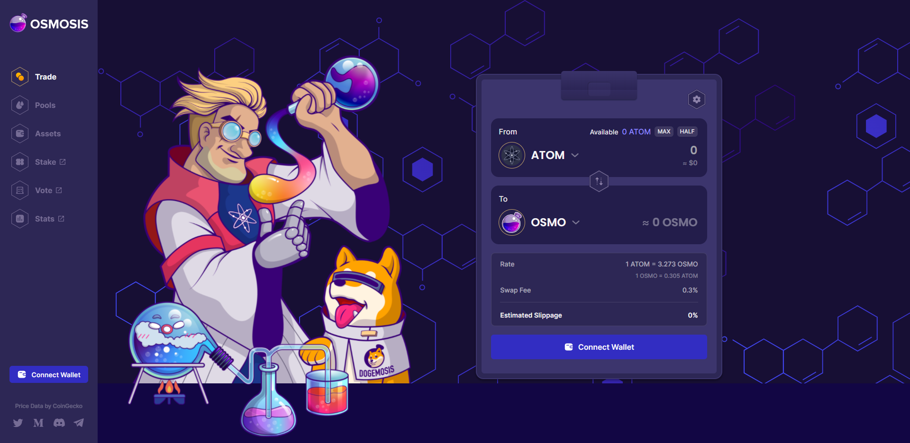
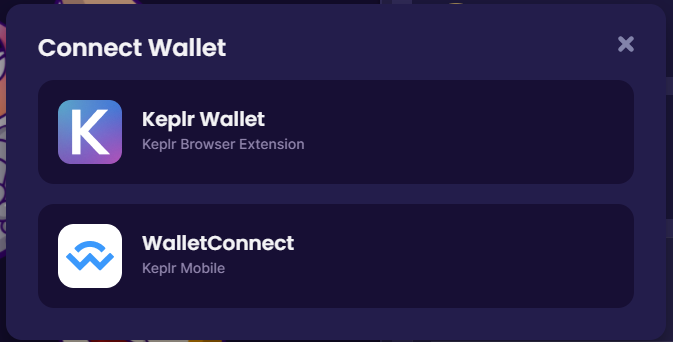
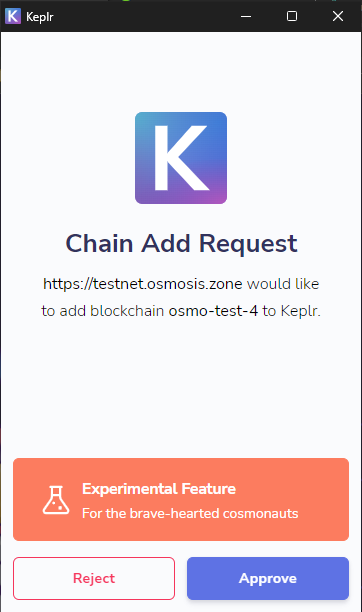
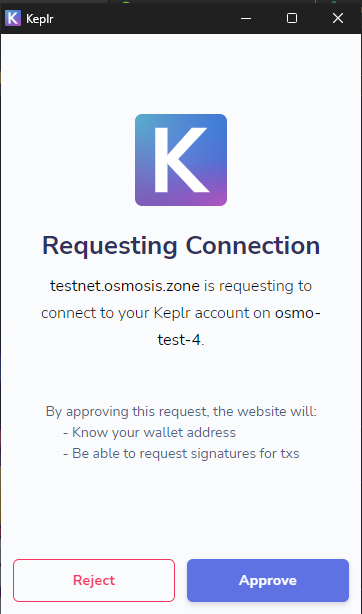

# I. Connect Keplr Wallet to Aura Testnet

1. Add Network to Keplr
```
await window['keplr'].experimentalSuggestChain({
	features: ['no-legacy-stdTx'],
	chainId: "aura-testnet",
	chainName: "aura testnet",
	rpc: "https://tendermint-testnet.aura.network",
	rest: "https://rpc-testnet.aura.network",
	bip44: {
		coinType: 118,
	},
	bech32Config: {
		bech32PrefixAccAddr: "aura",
		bech32PrefixAccPub: "aura" + "pub",
		bech32PrefixValAddr: "aura" + "valoper",
		bech32PrefixValPub: "aura" + "valoperpub",
		bech32PrefixConsAddr: "aura" + "valcons",
		bech32PrefixConsPub: "aura" + "valconspub",
	},
	currencies: [
		{
			coinDenom: "AURA",
			coinMinimalDenom: "uaura",
			coinDecimals: 6,
			// coinGeckoId: "aura",
		},
	],
	feeCurrencies: [
		{
			coinDenom: "AURA",
			coinMinimalDenom: "uaura",
			coinDecimals: 6,
			// coinGeckoId: "uaura",
		},
	],
	stakeCurrency: {
		coinDenom: "AURA",
		coinMinimalDenom: "uaura",
		coinDecimals: 6,
		// coinGeckoId: "uaura",
	},
	coinType: 118,
	gasPriceStep: {
		low: 1,
		average: 2.5,
		high: 4
	},
	walletUrlForStaking: "https://aura.network"
});
```
2. Detech Keplr
```
	if (!window.keplr) {
        alert("Please install keplr extension");
    } else {
        const chainId = "aura-testnet";

        // Enabling before using the Keplr is recommended.
        // This method will ask the user whether to allow access if they haven't visited this website.
        // Also, it will request that the user unlock the wallet if the wallet is locked.
        await window.keplr.enable(chainId);
    
        const offlineSigner = window.keplr.getOfflineSigner(chainId);
    
        // You can get the address/public keys by `getAccounts` method.
        // It can return the array of address/public key.
        // But, currently, Keplr extension manages only one address/public key pair.
        // XXX: This line is needed to set the sender address for SigningCosmosClient.
        const accounts = await offlineSigner.getAccounts();
		console.log(accounts)
    }
```
2. Unlock Keplr
```
	window.keplr.enable(chainId);
```
3. Get current address / Public key
```
	await offlineSigner.getAccounts();
	//or
	await offlineSigner.getAccounts(chainid);
```
4. Sign transaction
- Require: @cosmjs/stargate
```
	npm install @cosmjs/stargate
```

- Use SigningStargateClient
```
	const chainId = "aura-testnet";
	await window.keplr.enable(chainId);
	const offlineSigner = window.getOfflineSigner(chainId);

	const client = await SigningStargateClient.connectWithSigner(tendermintUrl, offlineSigner);
	const tx = {
        chainId: "aura-testnet",
        // accountNumber: "0",
        // sequence: "0",
        // fee: {
        //     amount: [{
        //         amount: "0",
        //         denom: "uatom",
        //     }],
        //     gas: "200000",
        // },
        msgs: [
            {
                type: "cosmos-sdk/MsgSend",
                value: {
                    from_address: sender.address,
                    to_address: "auraxxxxxxxxxxxxxxxxxxx",
                    amount: [{
                        amount: "1",
                        denom: "uaura",
                    }],
                },
            },
        ],
        memo: "",
    };
	// sign transaction
    const signedTx = await client.sign(tx);
    console.log(signedTx);
    // broadcast transaction
    const res = await client.broadcast(signedTx);
    console.log(res);
```

Reference: https://docs.keplr.app/api/

# II. Connect Keplr Wallet to other testnet
1. Vega Testnet (ATOM) <br>
Open a console on your browser, paste the following code to the console and execute.
```
var foo = async function(){
console.log('start request')
	await window.keplr.experimentalSuggestChain({
    chainId: "vega-testnet",
    chainName: "vega",
    rpc: "http://198.50.215.1:46657",
    rest: "http://198.50.215.1:4317",
    bip44: {
        coinType: 118,
    },
    bech32Config: {
        bech32PrefixAccAddr: "cosmos",
        bech32PrefixAccPub: "cosmos" + "pub",
        bech32PrefixValAddr: "cosmos" + "valoper",
        bech32PrefixValPub: "cosmos" + "valoperpub",
        bech32PrefixConsAddr: "cosmos" + "valcons",
        bech32PrefixConsPub: "cosmos" + "valconspub",
    },
    currencies: [
        {
            coinDenom: "ATOM",
            coinMinimalDenom: "uatom",
            coinDecimals: 6,
            coinGeckoId: "cosmos",
        },
    ],
    feeCurrencies: [
        {
            coinDenom: "ATOM",
            coinMinimalDenom: "uatom",
            coinDecimals: 6,
            coinGeckoId: "cosmos",
        },
    ],
    stakeCurrency: {
        coinDenom: "ATOM",
        coinMinimalDenom: "uatom",
        coinDecimals: 6,
        coinGeckoId: "cosmos",
    },
    coinType: 118,
     gasPriceStep: {
        low: 1,
        average: 1,
        high: 1,
    },
    features: ["stargate", "ibc-transfer", "no-legacy-stdTx"],
})
console.log('finish request')
}
setTimeout(()=> {
foo()
console.log(window.keplr)
}, 1000)
console.log('hello')
```
2. Terra Testnet (LUNA) <br>
Open a console on your browser, paste the following code to the console and execute.
```
await window['keplr'].experimentalSuggestChain({
	features: ['no-legacy-stdTx'],
	chainName: "terra testnet",
	chainId: "bombay-12",
	rpc: "https://bombay.stakesystems.io:2053",
	rest: "https://bombay.stakesystems.io",
	bip44: {
		coinType: 118,
	},
	bech32Config: {
		bech32PrefixAccAddr: "terra",
		bech32PrefixAccPub: "terra" + "pub",
		bech32PrefixValAddr: "terra" + "valoper",
		bech32PrefixValPub: "terra" + "valoperpub",
		bech32PrefixConsAddr: "terra" + "valcons",
		bech32PrefixConsPub: "terra" + "valconspub",
	},
	currencies: [
		{
			coinDenom: "LUNA",
			coinMinimalDenom: "uluna",
			coinDecimals: 6,
			// coinGeckoId: "LUNA",
		},
	],
	feeCurrencies: [
		{
			coinDenom: "LUNA",
			coinMinimalDenom: "uluna",
			coinDecimals: 6,
			// coinGeckoId: "uluna",
		},
	],
	stakeCurrency: {
		coinDenom: "LUNA",
		coinMinimalDenom: "uluna",
		coinDecimals: 6,
		// coinGeckoId: "uluna",
	},
	coinType: 118,
	gasPriceStep: {
		low: 1,
		average: 2.5,
		high: 4
	},
	walletUrlForStaking: "https://luna.network"
});
```
3. Juno Testnet (JUNO) <br>
Access JunoTools website: https://test.juno.tools/
 
Click on Connect Wallet and approve request add chain. <br>
 <br>
Approve request connect network. <br>
 <br>
4. Osmosis Testnet (OSMO) <br>
Access Osmosis Testnet website: https://testnet.osmosis.zone/

Click on Connect Wallet and select Keplr Wallet in the pop-up.
 <br>
Approve request add chain. <br>
 <br>
Approve request connect network. <br>
 <br>